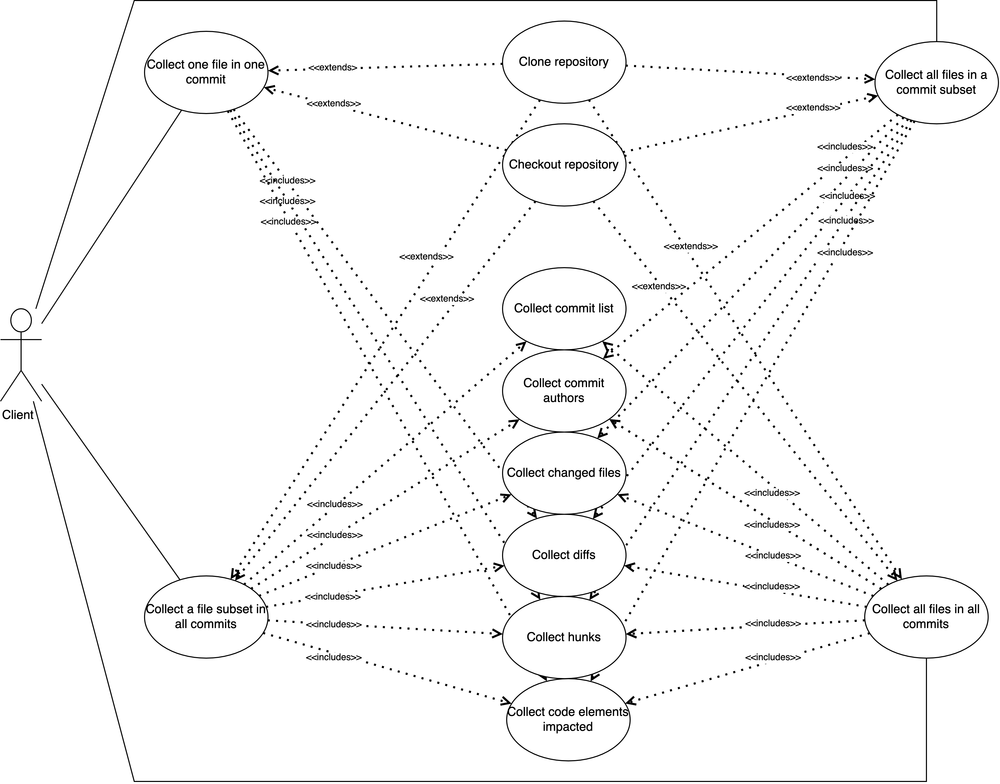
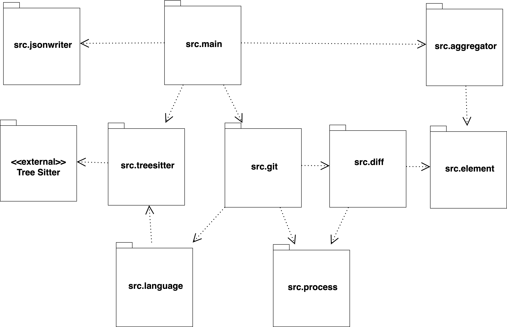
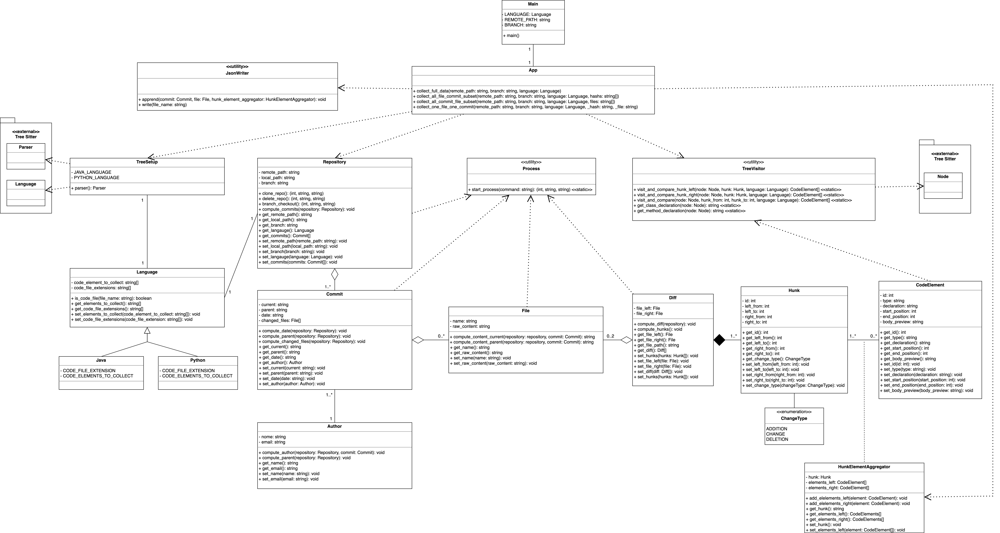

# Supressed
Several types of research in software engineering explore the mining of repositories (e.g Github). The main objective behind these explorations is to collect and analyze the vast amount of data available in these domains, generating knowledge ranging from findings on software evolution to observe the influence of human and social factors in software development.

When studying software evolution, it is common to collect data between system revisions, for instance, software metrics, change metrics, code smells, or even semantic changes in the source code. However, to collect the changes in semantic elements on the source code it is necessary to build its ASTs (Abstract Syntax Trees). Through the AST it is possible to identify precisely the elements that changed between revisions, in addition to their relationships with others.  

Supressed is a multilanguage tool that manages Git repositories, and analyses change between commits. Passing just the repository remote path, the tool yields a set of JSON files (one per commit) containing: changed files, commit author information, hunks of changes, and code elements impacted by the changes in the left file (before the change) and in the right file (after the change).

## Open Science 

This tool has scientific (but not limited) usage purposes. Thus, below we have some relevant questions and answers for researchers.

(i) What kind of scientific use is the project intended to be used for?

R: This tool facilitates data collection of source code element impacted by channges between revisions. Nowadays, when such collection is necessary, researchers dedicate time and effort to developing proprietary tools.

(ii) What are the benefits of using this project?

R: The tool is open-source, you can reference it and verify its source code. The data produced by this tool can de replicable by third-party researchers. Data is collected without the need for proprietary tools. Also, this tool increases the speed at which data are produced and hypotheses are tested.

(iii) What happens if questions arise during the tool usage?

R: Contact the developer by email: <supressed>.

**Important**: the consistency of scientific work can be jeopardized by this tool when results are produced by a version that is later found to be affected by a critical bug. By critical bugs, we mean those that change the final results produced by the tool.

# User Documentation

## Building 

In order to run this application, execute the following steps.

1. install the required packages:

    ```pip install -r requirements.txt```
    
2. Next, in the project root directory, clone the following repositories:
    ```
    git clone https://github.com/tree-sitter/tree-sitter-python
    git clone https://github.com/tree-sitter/tree-sitter-java
    ```
    
3. If you are a non unix user, you **MUST** install [gnudiff tool](https://www.gnu.org/software/diffutils/). For unix users, this tool is provided by default, no actions are required.

4. Run ```diff --version``` to check your installation. 

## Testing

- [**Test Guide and Logs**](./docs/tests.md)

## Executing

To execute this application:

1. Go to the [main file]() and set the following parammeters.
- *LANGUAGE*: assumes the value Java() or Python().  
    - Indicates the language of the source code in the target repository.

- *REMOTE_PATH*: the url of the target repository.
    - Indicates the remote path of the target repository.

- *BRANCH*: the target branch. 
    - Indicates the branch in the repository that must be analysed.

2. In the main method, there were four execution modes (as described in the Use Case Diagram). Choose the one that best fits your needs,              set the parameters *file* subset or *hash* subset if exists.

4. Then, run the application.

See the example below. In this case we run the second execution mode, analysing only one commit.

```
        LANGUAGE = Java()
        REMOTE_PATH = "https://github.com/<supressed>/Java.git"
        BRANCH = "master"

        def main():
                hashs = ['549a27a327e2ec273f20f894328081647800be0b']
                App().collect_all_file_commit_subset(REMOTE_PATH, BRANCH, LANGUAGE, hashs)
                '''
                Second execution mode.
                Collect data only for specific commits.
                '''

        if __name__ == "__main__":
            main()
```

### The output
```
    {
            "parent": "32cdf02afb448be9a47689c829005cf1e3719dc7",
            "date": "2022-01-02",
            "author": {
                "name": "Subh<supressed>",
                "email": "88422396+subhroblkb<supressed>"
            },
            "files": {
                "src/main/java/com/thealgorithms/ciphers/Caesar.java": {
                    "hunks": {
                        "337": {
                            "left_from": 93,
                            "left_to": 93,
                            "right_from": 94,
                            "right_to": 104,
                            "left_touched_elements": {
                                "2840": {
                                    "identifier": "class_declaration",
                                    "declaration": "Caesar",
                                    "start": 12,
                                    "end": 117,
                                    "body_preview": "public class Caesar {      /**..."
                                }
                            },
                            "right_touched_elements": {
                                "2841": {
                                    "identifier": "class_declaration",
                                    "declaration": "Caesar",
                                    "start": 12,
                                    "end": 139,
                                    "body_preview": "public class Caesar {      /**..."
                                },
                                "2842": {
                                    "identifier": "method_declaration",
                                    "declaration": "bruteforce",
                                    "start": 96,
                                    "end": 103,
                                    "body_preview": "public static String[] brutefo..."
                                },
                                "2843": {
                                    "identifier": "for_statement",
                                    "declaration": null,
                                    "start": 98,
                                    "end": 100,
                                    "body_preview": "for (int i=0; i<=26; i++) {   ..."
                                },
                                "2844": {
                                    "identifier": "binary_expression",
                                    "declaration": null,
                                    "start": 98,
                                    "end": 98,
                                    "body_preview": "i<=26..."
                                }
                            }
                        },
                        ...
                        ...
        }
```

This output fragment shows that one file has changed (*src/main/java/com/thealgorithms/ciphers/Caesar.java*). The change impact line 93 in the left file, and lines 94 to 104 in the right file. 

In the left file, a *class* called *Caesar* was impacted. In the right file, a *class* called *Caesar*, a *method* called *bruteforce*, a *for statement*, and one *binary expression* were impacted by the changes.

### Code Elements 

You can verify or change the code elements collected by the tool in the following files:

- [Java]() <supressed>
- [Python]() <supressed>

## Requirements

### Functional

| ID    | Requirement                                                                                             |
|-------|---------------------------------------------------------------------------------------------------------|
| FR01  | The system should clone remote repositories locally.                                                    |
| FR02  | The system should delete a local repository, previously cloned (FR01).                                  |
| FR03  | The system should checkout a local repository (FR01), in a specific branch.                             |
| FR04  | The system should compute the full list of commits in a branch.                                         |
| FR05  | The system should compute information about the author of commits.                                      |
| FR06  | The system should compute modified files in commits.                                                    |
| FR07  | The system should be able to create diffs between two version of a file.                                |
| FR08  | Using diffs (FR07) the system should be able to extract hunks of changes.                               |
| FR09  | Using parsing libraries the system should build ASTs of source code files.                              |
| FR010 | The system should be able to navigate over ASTs (FR09), and identify code elements impacted by changes. |
| FR011 | The system should support the alaysis of repositories in Java and Python.                               |
| FR012 | The system should produce json files as output, one per commit.                                         |

### Non Functional

| ID    | Requirement                                                                |
|-------|----------------------------------------------------------------------------|
| NFR01 | The system should use the GNUDiff tool to generate diffs between files.    |
| NFR02 | The system should use TreeSitter as library for AST parsing.               |
| NFR03 | The system should support analysis of Git repositories.                    |
| NFR04 | The system should be extensible for support repositories in new languages. |


### Use Case Diagram


### Package Diagram


### Class Diagram

